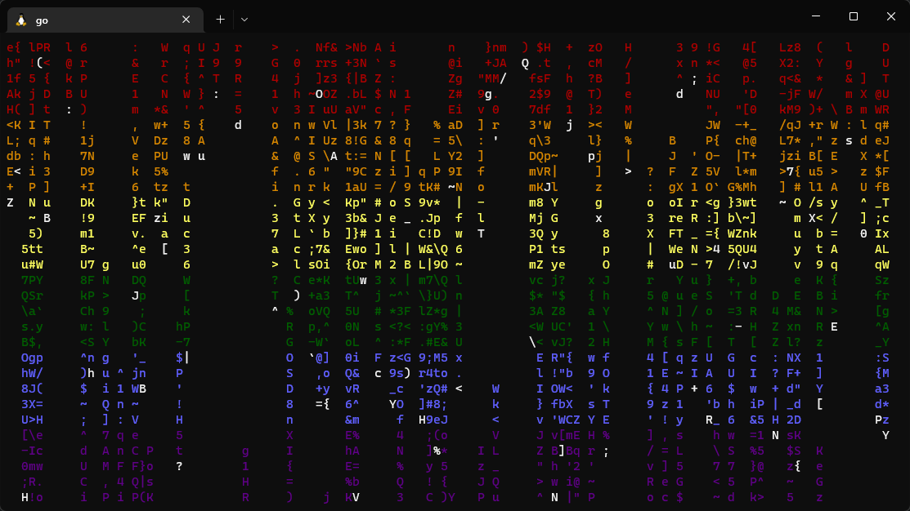
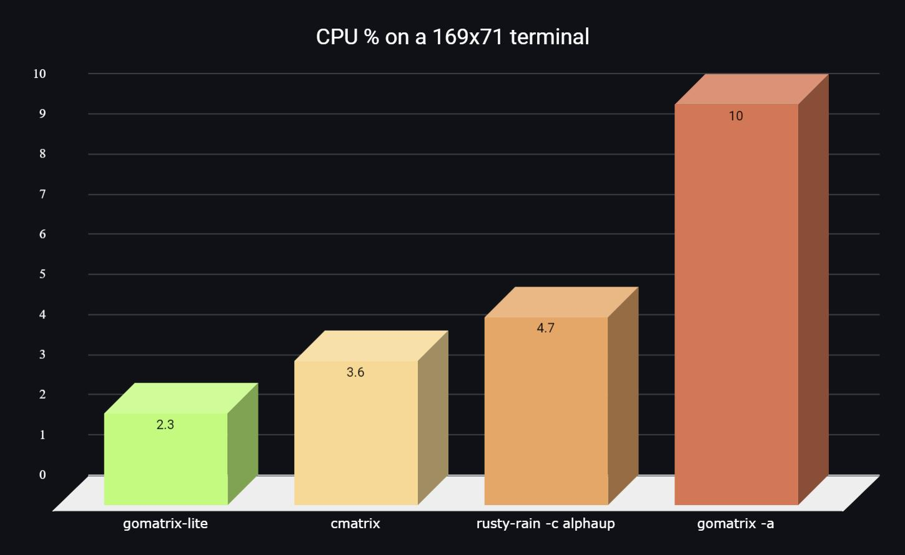

# gomatrix-lite  [](https://goreportcard.com/report/github.com/hytromo/gomatrix-lite) [](https://www.codacy.com/gh/hytromo/gomatrix-lite/dashboard) [](https://opensource.org/licenses/MIT)

<h1 align="center">
<br>
<br>

<br>
<br>
<h2 align="center">
Now with pride mode 🏳️‍🌈😎
<br>
<br>

</h2>
<br>
<br>
</h1>

- [Usage](#usage)
- [Installation](#installation)
- [Purpose](#purpose)

# Usage

```
Usage:
  gomatrix-lite [OPTIONS]

Application Options:
  -v, --version   Show version
  -c, --color=    Matrix colors, can be up to 2 comma-separated colors for gradient (default: 000000,00FF00)
  -s, --speed=    The speed, 0 through 9 (default: 8)
      --no-async  Disable asynchronous mode, make every line have the same speed
      --no-bold   Disable bold characters
      --pride     Add LGBT Pride flag colors, overrides -color

Help Options:
  -h, --help      Show this help message
```

Use the numbers 0-9 to control the speed. Use `q` or Ctrl+C to quit the app.

# Installation

Go over to the <a href="../../releases">Releases</a> and pick up a tarballed binary for your OS/arch, or a packaged file (deb, rpm etc)

# Purpose

This is obviously just a toy to see how easy it'd be to make something like `cmatrix` using Golang.

The name came from the fact that this seems to be lighter on the CPU usage from quite a few other implementations:

<h1 align="center">

</h1>

The comparison was made with as similar settings as possible (speed, character set) and in terminals of the same dimensions.
Not much thought has gone into this project, it probably can be optimized more.
